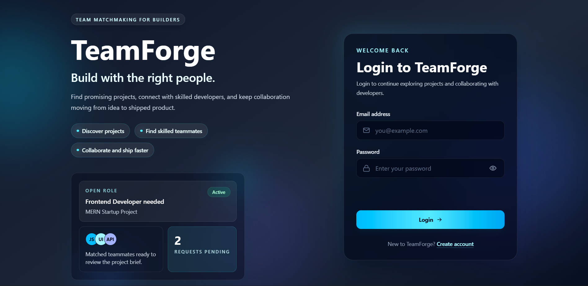
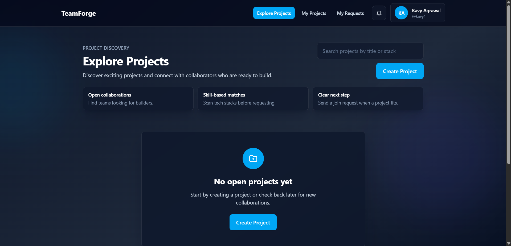
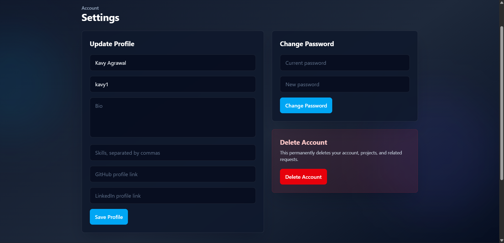
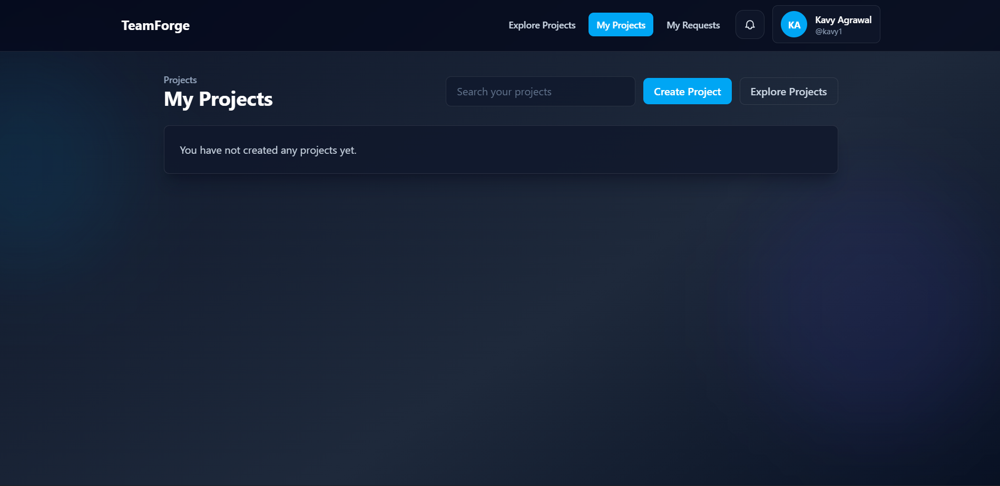
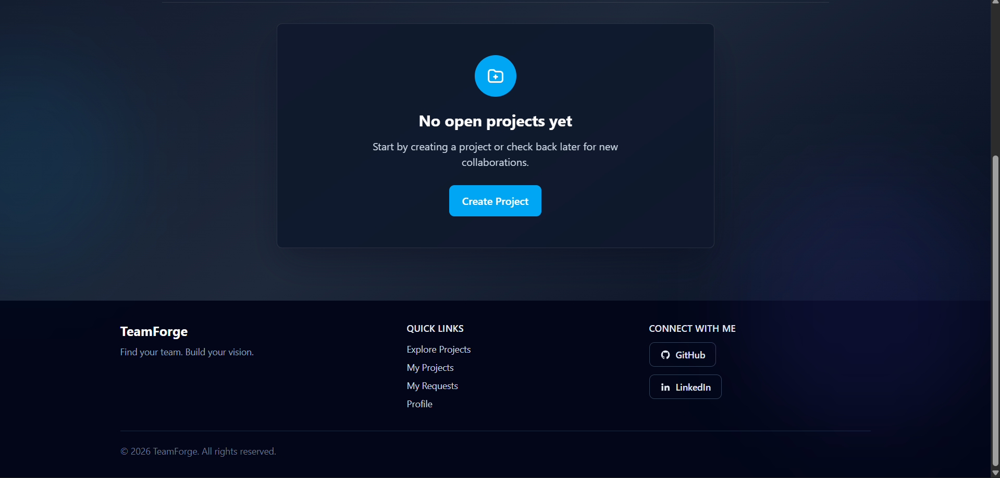

# 🚀 TeamForge

> A full-stack developer collaboration platform that helps developers discover projects, connect with compatible teammates, and build together in real time.

---

## 🌐 Live Demo

**🔗 Live Application:** [https://teamforge-frontend-nine.vercel.app](https://teamforge-frontend-nine.vercel.app)

---

# 📌 About TeamForge

TeamForge is a production-ready MERN stack platform designed to solve a common problem faced by developers:

> *Finding the right people and the right projects to collaborate on.*

Developers can:

* Create and showcase projects
* Explore projects posted by others
* Send collaboration requests
* Accept or reject teammates
* Receive real-time notifications
* Connect with developers based on tech stack compatibility

The platform focuses on scalable backend architecture, secure authentication, clean API design, and real-world production deployment.

---

# ✨ Features

## 👤 Authentication & Security

* JWT Authentication
* Refresh & Access Token Flow
* HTTP-only Cookie-Based Sessions
* Protected Routes & Middleware
* Rate Limiting for Auth & APIs
* Secure Password Hashing with bcrypt

## 📂 Project Management

* Create, update, and delete projects
* Explore projects posted by other developers
* Search and filter projects efficiently
* Pagination support for scalability
* Tech stack & role-based project matching

## 🤝 Collaboration Workflow

* Send collaboration requests
* Accept or reject incoming requests
* View sent and received requests
* Prevent duplicate collaboration requests

## 🔔 Real-Time Notifications

* Socket.IO powered notification system
* Instant updates for request actions
* Real-time user connection handling

## ⚡ Production Engineering

* Cloud deployment with Render & Vercel
* MongoDB Atlas integration
* CORS & cookie handling for production
* Centralized error handling
* Scalable REST API architecture
* Environment-based configuration

---

# 🛠️ Tech Stack

## Frontend

* React.js
* Vite
* React Router DOM
* Axios
* Tailwind CSS
* Bootstrap
* Socket.IO Client

## Backend

* Node.js
* Express.js
* MongoDB
* Mongoose
* Socket.IO
* JWT Authentication
* Express Rate Limit
* Cookie Parser
* bcrypt

## Deployment & Cloud

* Vercel (Frontend)
* Render (Backend)
* MongoDB Atlas

---

# 🧠 Backend Architecture Highlights

## 🔹 Authentication System

Implemented a scalable authentication flow using:

* Short-lived Access Tokens
* Long-lived Refresh Tokens
* Automatic token refresh handling
* HTTP-only cookies for enhanced security

---

## 🔹 Scalable API Design

Designed RESTful APIs with:

* Pagination
* Filtering
* Search pipelines
* Consistent response structures
* Centralized error handling

---

## 🔹 Real-Time Communication

Integrated Socket.IO for:

* Real-time notifications
* User connection tracking
* Instant collaboration updates

---

# 📁 Folder Structure

```bash
TeamForge/
│
├── Backend/
│   ├── src/
│   │   ├── config/
│   │   ├── controllers/
│   │   ├── middlewares/
│   │   ├── models/
│   │   ├── routes/
│   │   ├── utils/
│   │   ├── socket.js
│   │   ├── app.js
│   │   └── server.js
│   │
│   └── package.json
│
├── Frontend/
│   ├── src/
│   │   ├── components/
│   │   ├── pages/
│   │   ├── services/
│   │   ├── contexts/
│   │   └── App.jsx
│   │
│   └── package.json
│
└── README.md
```

---

# ⚙️ Local Setup

## 1️⃣ Clone Repository

```bash
git clone https://github.com/kavyagrwl25/TeamForge.git
```

---

## 2️⃣ Backend Setup

```bash
cd Backend
npm install
npm run dev
```

Create `.env` inside Backend:

```env
PORT=4000
NODE_ENV=development
MONGO_URI=your_mongodb_uri
CORS_ORIGIN=http://localhost:5173
ACCESS_TOKEN_SECRET=your_secret
ACCESS_TOKEN_EXPIRY=15m
REFRESH_TOKEN_SECRET=your_secret
REFRESH_TOKEN_EXPIRY=7d
```

---

## 3️⃣ Frontend Setup

```bash
cd Frontend
npm install
npm run dev
```

Create `.env` inside Frontend:

```env
VITE_API_BASE_URL=http://localhost:4000/api/v1
```

---

# 📡 API Highlights

## User Routes

* User Registration
* Login & Logout
* Refresh Tokens
* Change Password
* Profile Management

## Project Routes

* Create Project
* Update Project
* Delete Project
* Explore Projects
* Search & Pagination

## Collaboration Routes

* Send Request
* Accept/Reject Request
* View Requests

## Notification Routes

* Real-Time Notifications
* Read/Unread Handling

---

# 🚀 Deployment

## Frontend Deployment

* Hosted on Vercel
* Configured SPA routing using `vercel.json`

## Backend Deployment

* Hosted on Render
* Connected to MongoDB Atlas
* Production CORS & cookie handling configured

---

# 📈 Future Improvements

* AI-powered project recommendations
* Fake project/spam detection system
* Team chat functionality
* Advanced developer matching
* Project analytics dashboard
* Redis caching layer
* Dockerized deployment
* CI/CD pipeline integration
* Scalable notification queue system

---

# 📸 Screenshots






---

# 🤝 Contributing

Contributions, ideas, and feedback are always welcome.

Feel free to fork the project and open a pull request.

---

# 👨‍💻 Author

**Kavya Agrawal**

* GitHub: [https://github.com/](https://github.com/)
* LinkedIn: [https://linkedin.com/](https://linkedin.com/)

---

# ⭐ Support

If you found this project helpful, consider giving it a star ⭐
and sharing it with others!